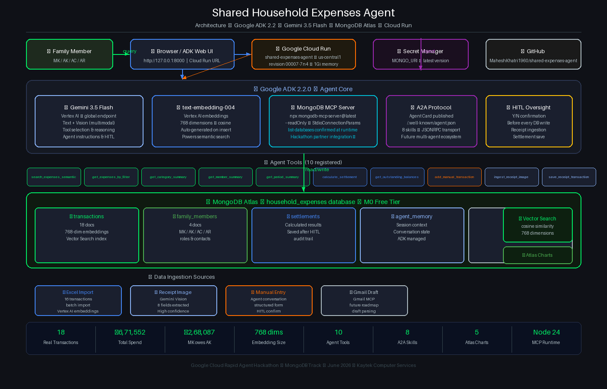

\# Shared Household Expenses Agent


An AI-powered shared expense tracker and reconciliation agent for families,

built with Google ADK 2.2.0, Gemini 3.5 Flash, MongoDB Atlas Vector Search,

and MongoDB MCP Server.


\## The Problem


When multiple family members share significant expenses — such as medical

care for an ailing parent — tracking contributions fairly and calculating

accurate settlements is complex and error-prone without a dedicated system.


\## The Solution


A conversational AI agent that lets family members query expenses, understand

spending patterns, and calculate settlements using natural language — backed

by MongoDB Atlas with Vector Search for semantic understanding.


\## Features


\- Natural language expense queries ("Show me Papa's medical expenses")

\- Semantic search using MongoDB Atlas Vector Search + Vertex AI embeddings

\- Category, member, and period-wise summaries

\- Automatic settlement calculation

\- Manual transaction entry via agent conversation

\- Expense owner tracking: DAD / MOM / HOUSEHOLD / FAMILY

\- MongoDB MCP Server integration for direct database operations


\## Tech Stack


| Component | Technology |

|---|---|

| Agent Framework | Google ADK 2.2.0 |

| AI Model | Gemini 3.5 Flash (Vertex AI) |

| Database | MongoDB Atlas M0 |

| Vector Search | MongoDB Atlas Vector Search |

| Embeddings | Vertex AI text-embedding-004 (768 dims) |

| MCP Server | MongoDB MCP Server (npx) |

| Language | Python 3.14 |

| Platform | Google Cloud (us-central1) |


\## Setup Instructions


\### Prerequisites


\- Python 3.9+

\- Node.js 18+ and npx

\- Google Cloud account with Vertex AI enabled

\- MongoDB Atlas account (free M0 tier works)

\- Google Cloud CLI (`gcloud`)


\### Installation


\*\*Step 1: Clone the repository\*\*

```bash

git clone https://github.com/YOUR\_USERNAME/shared-expenses-agent.git

cd shared-expenses-agent

```


\*\*Step 2: Install Python dependencies\*\*

```bash

pip install -r requirements.txt

```


\*\*Step 3: Configure environment\*\*

```bash

cp .env.example .env

\# Edit .env with your MongoDB URI and GCP project details

```


\*\*Step 4: Authenticate with Google Cloud\*\*

```bash

gcloud auth application-default login

gcloud auth application-default set-quota-project YOUR\_GCP\_PROJECT

```


\*\*Step 5: Run the agent\*\*

```bash

adk web .

```


Open http://localhost:8000 in your browser.


\## Example Queries


\- "How much did we spend on nursing staff?"

\- "Show me all Papa's medical expenses"

\- "Calculate settlement for all time"

\- "Who paid the most?"

\- "Give me a category breakdown of all expenses"

\- "Add expense: MK paid 5000 to Apollo Pharmacy on 2026-06-08"


\## Architecture


User (Browser)

↓

Google ADK 2.2.0 (adk web)

↓

Gemini 3.5 Flash (Vertex AI — global endpoint)

↓

Tools:

├── search\_expenses\_semantic    → MongoDB Atlas Vector Search

├── get\_expenses\_by\_filter      → MongoDB aggregation pipeline

├── get\_category\_summary        → MongoDB aggregation pipeline

├── get\_member\_summary          → MongoDB aggregation pipeline

├── get\_period\_summary          → MongoDB aggregation pipeline

├── calculate\_settlement        → Settlement algorithm + Atlas save

├── get\_outstanding\_balances    → All-time balance check

├── add\_manual\_transaction      → Insert with Vertex AI embedding

└── MongoDB MCP Server          → Direct Atlas operations via npx

↓

MongoDB Atlas (household\_expenses database)

├── transactions    (16 real records with embeddings)

├── family\_members  (MK, AK, AC, AR)

├── settlements     (calculated settlement records)

├── agent\_memory    (conversation context)

└── time\_logs       (time tracking)


## Architecture Diagram



\## Hackathon


## Future Improvements
- MongoDB Atlas Auto Embeddings (Voyage AI) — replace 
  manual Vertex AI embedding pipeline
- Gmail draft ingestion via Gmail MCP Server
- Time Value of Money settlement calculations at 
  configurable cost of capital
- Voice input via Gemini 3.1 Flash Live API
- Field-level transaction correction tool
- MongoDB Time Series for daily interest accrual tracking
- MongoDB Client-Side Field Level Encryption (CSFLE)
- Full A2A task endpoint for multi-agent communication
- Ledger Accounting Agent integration via A2A protocol
- Multi-family household support

Built for the Google Cloud Rapid Agent Hackathon (June 2026).

MongoDB partner track.


\## License


MIT License — see LICENSE file for details.


